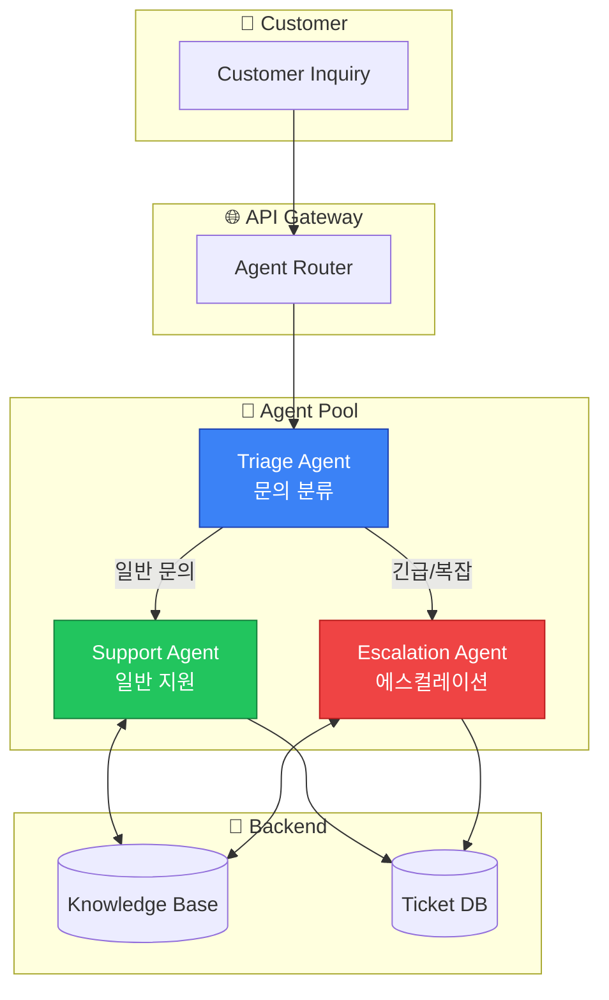
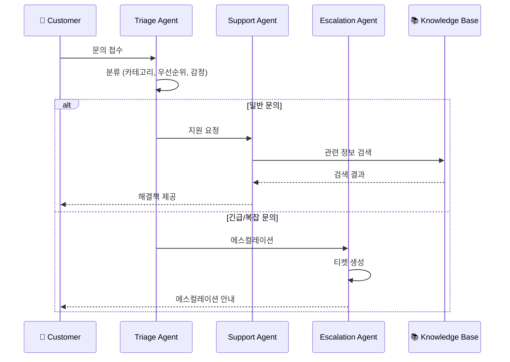

# 고객 서비스 자동화


AutoGen을 활용한 지능형 고객 서비스 시스템 구축 사례입니다.

## 아키텍처 개요



## 문의 처리 흐름



## 에이전트 구현

### Triage Agent (분류 에이전트)

```python
from autogen import AssistantAgent, UserProxyAgent

# 분류 에이전트 - 문의 유형 분류
triage_agent = AssistantAgent(
    name="triage_agent",
    system_message="""You are a customer service triage agent.
Your role is to:
1. Classify incoming customer inquiries into categories:
   - BILLING: Payment, invoices, subscriptions
   - TECHNICAL: Product issues, bugs, errors
   - GENERAL: Information, feedback, other
   - URGENT: Security issues, service outages

2. Extract key information:
   - Customer sentiment (positive/neutral/negative)
   - Priority level (low/medium/high/critical)
   - Required actions

3. Output format (JSON):
{
    "category": "BILLING|TECHNICAL|GENERAL|URGENT",
    "sentiment": "positive|neutral|negative",
    "priority": "low|medium|high|critical",
    "summary": "Brief summary of the issue",
    "extracted_info": {
        "order_id": "if mentioned",
        "product": "if mentioned",
        "error_code": "if mentioned"
    },
    "suggested_action": "next step recommendation"
}
""",
    llm_config={
        "config_list": config_list,
        "temperature": 0.1,
        "response_format": {"type": "json_object"}
    }
)

def classify_inquiry(inquiry: str) -> dict:
    """문의 분류"""
    import json

    user_proxy = UserProxyAgent(
        name="classifier",
        human_input_mode="NEVER",
        max_consecutive_auto_reply=1
    )

    result = user_proxy.initiate_chat(
        triage_agent,
        message=f"Classify this customer inquiry:\n\n{inquiry}",
        max_turns=1
    )

    # JSON 응답 파싱
    response = result.chat_history[-1]["content"]
    return json.loads(response)
```

### Support Agent (지원 에이전트)

```python
from typing import Optional
import json

# 지식 베이스 검색 함수
def search_knowledge_base(query: str, category: str) -> list[dict]:
    """지식 베이스 검색"""
    # 실제 구현에서는 벡터 DB나 Elasticsearch 사용
    knowledge_base = {
        "BILLING": [
            {"topic": "refund_policy", "content": "Refunds are processed within 5-7 business days..."},
            {"topic": "subscription_cancel", "content": "To cancel your subscription, go to Settings > Billing..."},
        ],
        "TECHNICAL": [
            {"topic": "login_issues", "content": "If you're having trouble logging in, try clearing your cache..."},
            {"topic": "error_codes", "content": "Error E001: Connection timeout. Please check your internet..."},
        ]
    }

    results = knowledge_base.get(category, [])
    # 간단한 키워드 매칭 (실제로는 semantic search 사용)
    relevant = [r for r in results if any(word in r["content"].lower() for word in query.lower().split())]
    return relevant

# 지원 에이전트
support_agent = AssistantAgent(
    name="support_agent",
    system_message="""You are a friendly and helpful customer support agent.

Guidelines:
1. Always be polite and empathetic
2. Provide clear, step-by-step solutions
3. If you cannot solve the issue, explain what you're doing to help
4. Offer additional assistance at the end

Your responses should:
- Acknowledge the customer's concern
- Provide relevant information from the knowledge base
- Give actionable steps when possible
- Set clear expectations for resolution

If you need to escalate, clearly explain why and what will happen next.
""",
    llm_config={
        "config_list": config_list,
        "temperature": 0.7,
        "functions": [
            {
                "name": "search_knowledge_base",
                "description": "Search the knowledge base for relevant information",
                "parameters": {
                    "type": "object",
                    "properties": {
                        "query": {"type": "string", "description": "Search query"},
                        "category": {"type": "string", "enum": ["BILLING", "TECHNICAL", "GENERAL"]}
                    },
                    "required": ["query", "category"]
                }
            }
        ]
    }
)

# 함수 실행 핸들러
def execute_function(name: str, arguments: dict) -> str:
    if name == "search_knowledge_base":
        results = search_knowledge_base(**arguments)
        return json.dumps(results)
    return json.dumps({"error": "Unknown function"})
```

### Escalation Agent (에스컬레이션 에이전트)

```python
escalation_agent = AssistantAgent(
    name="escalation_agent",
    system_message="""You are an escalation specialist for complex customer issues.

Your responsibilities:
1. Handle issues that require special attention or authority
2. Coordinate with multiple departments if needed
3. Create detailed tickets for human review
4. Ensure customer is informed about the escalation process

When handling escalations:
- Document all relevant details
- Identify the root cause if possible
- Propose solutions or workarounds
- Set realistic timelines for resolution

Output escalation tickets in this format:
{
    "ticket_id": "ESC-XXXX",
    "priority": "high|critical",
    "departments_involved": ["billing", "technical", "management"],
    "issue_summary": "...",
    "customer_impact": "...",
    "proposed_resolution": "...",
    "estimated_resolution_time": "...",
    "customer_communication": "Message to send to customer"
}
""",
    llm_config={
        "config_list": config_list,
        "temperature": 0.3
    }
)
```

## 전체 워크플로우 구현

```python
from enum import Enum
from dataclasses import dataclass
from datetime import datetime

class TicketStatus(Enum):
    OPEN = "open"
    IN_PROGRESS = "in_progress"
    ESCALATED = "escalated"
    RESOLVED = "resolved"
    CLOSED = "closed"

@dataclass
class SupportTicket:
    ticket_id: str
    customer_id: str
    inquiry: str
    category: str
    priority: str
    status: TicketStatus
    created_at: datetime
    conversation_history: list
    resolution: Optional[str] = None

class CustomerServiceSystem:
    """고객 서비스 시스템"""

    def __init__(self, config_list: list):
        self.config_list = config_list
        self.tickets = {}
        self._setup_agents()

    def _setup_agents(self):
        """에이전트 설정"""
        self.triage = triage_agent
        self.support = support_agent
        self.escalation = escalation_agent

        self.user_proxy = UserProxyAgent(
            name="system",
            human_input_mode="NEVER",
            code_execution_config=False
        )

    def handle_inquiry(self, customer_id: str, inquiry: str) -> dict:
        """문의 처리"""
        # 1. 분류
        classification = self._classify(inquiry)

        # 2. 티켓 생성
        ticket = self._create_ticket(customer_id, inquiry, classification)

        # 3. 우선순위에 따른 처리
        if classification["priority"] in ["critical", "high"] or classification["category"] == "URGENT":
            response = self._escalate(ticket)
        else:
            response = self._handle_support(ticket)

        return {
            "ticket_id": ticket.ticket_id,
            "response": response,
            "status": ticket.status.value
        }

    def _classify(self, inquiry: str) -> dict:
        """문의 분류"""
        result = self.user_proxy.initiate_chat(
            self.triage,
            message=f"Classify: {inquiry}",
            max_turns=1
        )

        return json.loads(result.chat_history[-1]["content"])

    def _create_ticket(self, customer_id: str, inquiry: str,
                       classification: dict) -> SupportTicket:
        """티켓 생성"""
        import uuid

        ticket = SupportTicket(
            ticket_id=f"TKT-{uuid.uuid4().hex[:8].upper()}",
            customer_id=customer_id,
            inquiry=inquiry,
            category=classification["category"],
            priority=classification["priority"],
            status=TicketStatus.OPEN,
            created_at=datetime.now(),
            conversation_history=[]
        )

        self.tickets[ticket.ticket_id] = ticket
        return ticket

    def _handle_support(self, ticket: SupportTicket) -> str:
        """일반 지원 처리"""
        ticket.status = TicketStatus.IN_PROGRESS

        # 지식 베이스 검색
        kb_results = search_knowledge_base(ticket.inquiry, ticket.category)

        context = f"""
Customer Inquiry: {ticket.inquiry}
Category: {ticket.category}
Knowledge Base Results: {json.dumps(kb_results)}

Please provide a helpful response to the customer.
"""

        result = self.user_proxy.initiate_chat(
            self.support,
            message=context,
            max_turns=3
        )

        response = result.chat_history[-1]["content"]
        ticket.conversation_history.append({
            "role": "agent",
            "content": response,
            "timestamp": datetime.now().isoformat()
        })

        # 해결 여부 확인
        if self._is_resolved(result):
            ticket.status = TicketStatus.RESOLVED
            ticket.resolution = response

        return response

    def _escalate(self, ticket: SupportTicket) -> str:
        """에스컬레이션 처리"""
        ticket.status = TicketStatus.ESCALATED

        context = f"""
ESCALATION REQUIRED

Ticket ID: {ticket.ticket_id}
Customer ID: {ticket.customer_id}
Category: {ticket.category}
Priority: {ticket.priority}

Original Inquiry:
{ticket.inquiry}

Conversation History:
{json.dumps(ticket.conversation_history, indent=2)}

Please create an escalation ticket and draft a message for the customer.
"""

        result = self.user_proxy.initiate_chat(
            self.escalation,
            message=context,
            max_turns=2
        )

        escalation_response = result.chat_history[-1]["content"]

        # 에스컬레이션 티켓 파싱
        try:
            esc_data = json.loads(escalation_response)
            return esc_data.get("customer_communication", escalation_response)
        except:
            return escalation_response

    def _is_resolved(self, chat_result) -> bool:
        """해결 여부 판단"""
        last_message = chat_result.chat_history[-1]["content"].lower()
        resolution_indicators = [
            "resolved", "solved", "fixed",
            "let me know if you need", "anything else"
        ]
        return any(ind in last_message for ind in resolution_indicators)

    def follow_up(self, ticket_id: str, message: str) -> str:
        """후속 문의 처리"""
        ticket = self.tickets.get(ticket_id)
        if not ticket:
            return "Ticket not found"

        ticket.conversation_history.append({
            "role": "customer",
            "content": message,
            "timestamp": datetime.now().isoformat()
        })

        return self._handle_support(ticket)

# 사용 예시
system = CustomerServiceSystem(config_list)

# 새 문의 처리
result = system.handle_inquiry(
    customer_id="CUST-001",
    inquiry="I've been charged twice for my subscription this month. Order #12345"
)

print(f"Ticket: {result['ticket_id']}")
print(f"Response: {result['response']}")
```

## 고급 기능

### 감정 분석 기반 대응

```python
def get_empathetic_response(sentiment: str, base_response: str) -> str:
    """감정에 맞는 응대"""
    empathy_prefix = {
        "negative": "I completely understand your frustration, and I sincerely apologize for the inconvenience. ",
        "neutral": "Thank you for reaching out to us. ",
        "positive": "Thank you for your kind message! "
    }

    return empathy_prefix.get(sentiment, "") + base_response
```

### 다국어 지원

```python
multilingual_support_agent = AssistantAgent(
    name="multilingual_support",
    system_message="""You are a multilingual customer support agent.

1. Detect the language of the customer's message
2. Respond in the same language
3. Maintain professional tone in all languages
4. If unsure about translation, ask for clarification

Supported languages: English, Korean, Japanese, Chinese, Spanish
""",
    llm_config={"config_list": config_list}
)
```

### 자동 FAQ 생성

```python
def generate_faq_from_tickets(tickets: list[SupportTicket]) -> list[dict]:
    """해결된 티켓에서 FAQ 생성"""

    resolved_tickets = [t for t in tickets if t.status == TicketStatus.RESOLVED]

    faq_generator = AssistantAgent(
        name="faq_generator",
        system_message="""Analyze resolved support tickets and generate FAQ entries.

Output format:
[
    {
        "question": "Common question",
        "answer": "Concise answer",
        "category": "BILLING|TECHNICAL|GENERAL",
        "keywords": ["keyword1", "keyword2"]
    }
]
""",
        llm_config={"config_list": config_list}
    )

    # 티켓 데이터 준비
    ticket_summaries = [
        {"inquiry": t.inquiry, "resolution": t.resolution}
        for t in resolved_tickets[:50]  # 최근 50개
    ]

    user_proxy = UserProxyAgent(name="system", human_input_mode="NEVER")

    result = user_proxy.initiate_chat(
        faq_generator,
        message=f"Generate FAQ from these tickets:\n{json.dumps(ticket_summaries)}",
        max_turns=1
    )

    return json.loads(result.chat_history[-1]["content"])
```

## 성능 메트릭

```python
@dataclass
class ServiceMetrics:
    """서비스 메트릭"""
    total_tickets: int = 0
    resolved_tickets: int = 0
    escalated_tickets: int = 0
    avg_resolution_time: float = 0.0
    customer_satisfaction: float = 0.0

    def calculate(self, tickets: list[SupportTicket]):
        self.total_tickets = len(tickets)
        self.resolved_tickets = sum(1 for t in tickets if t.status == TicketStatus.RESOLVED)
        self.escalated_tickets = sum(1 for t in tickets if t.status == TicketStatus.ESCALATED)

        resolved = [t for t in tickets if t.status == TicketStatus.RESOLVED and t.resolution]
        if resolved:
            # 해결 시간 계산 (실제로는 resolved_at 필드 필요)
            pass

        return self

    def to_dict(self) -> dict:
        return {
            "total_tickets": self.total_tickets,
            "resolution_rate": self.resolved_tickets / max(self.total_tickets, 1),
            "escalation_rate": self.escalated_tickets / max(self.total_tickets, 1)
        }
```

## 배포 체크리스트

- [ ] API 키 보안 설정 (환경 변수, 시크릿 매니저)
- [ ] 지식 베이스 데이터 준비
- [ ] 에스컬레이션 워크플로우 정의
- [ ] 모니터링 및 알림 설정
- [ ] 응답 품질 검토 프로세스
- [ ] 고객 피드백 수집 메커니즘
- [ ] 백업 및 복구 계획
