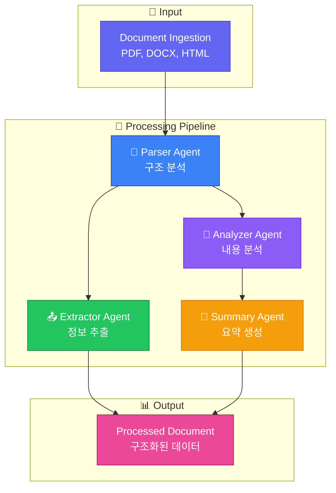
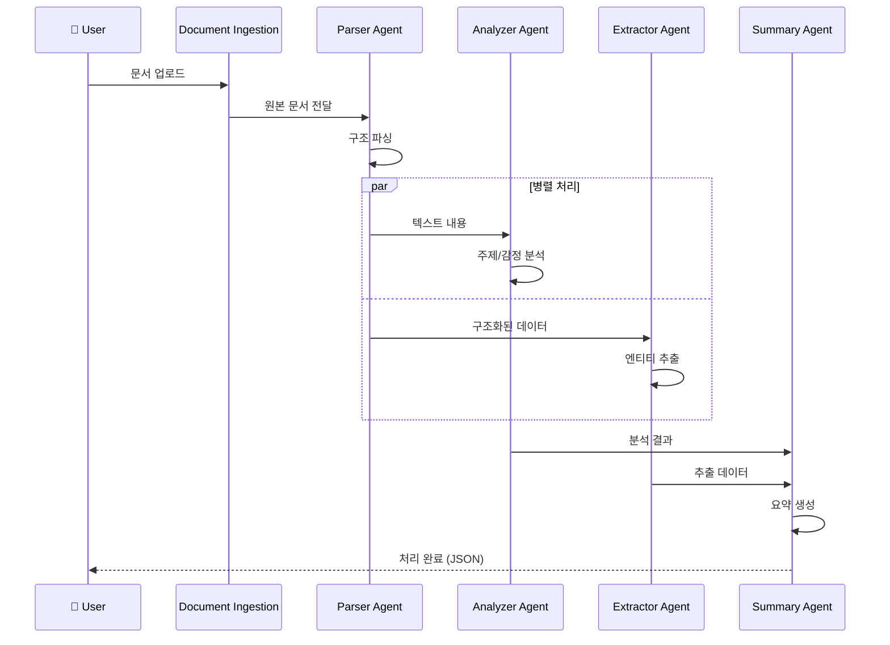

# 문서 처리 시스템


AutoGen을 활용한 지능형 문서 분석 및 처리 시스템 구축 사례입니다.

## 시스템 개요



### 문서 처리 흐름



## 에이전트 구현

### Document Parser Agent

```python
from autogen import AssistantAgent, UserProxyAgent

parser_agent = AssistantAgent(
    name="document_parser",
    system_message="""You are a document parsing specialist.

Your responsibilities:
1. Identify document structure and format
2. Extract text content accurately
3. Preserve formatting information
4. Handle various document types (PDF, Word, HTML)

Output format:
```json
{
    "document_type": "pdf|docx|html|txt",
    "metadata": {
        "title": "...",
        "author": "...",
        "date": "...",
        "pages": 0
    },
    "structure": {
        "sections": [...],
        "tables": [...],
        "figures": [...]
    },
    "content": "extracted text..."
}
```
""",
    llm_config={
        "config_list": config_list,
        "temperature": 0.1
    }
)
```

### Content Analyzer Agent

```python
analyzer_agent = AssistantAgent(
    name="content_analyzer",
    system_message="""You are a content analysis expert.

Your responsibilities:
1. Identify key themes and topics
2. Extract entities (people, organizations, dates)
3. Detect sentiment and tone
4. Classify document type and purpose

Analysis categories:
- Legal: Contracts, agreements, terms
- Financial: Reports, statements, invoices
- Technical: Manuals, specifications, docs
- Business: Proposals, presentations, memos

Output comprehensive analysis with confidence scores.
""",
    llm_config={
        "config_list": config_list,
        "temperature": 0.3
    }
)
```

### Information Extractor Agent

```python
extractor_agent = AssistantAgent(
    name="information_extractor",
    system_message="""You are an information extraction specialist.

Extract structured data from documents:
1. Named Entities: People, Organizations, Locations, Dates
2. Key-Value Pairs: Important fields and their values
3. Relationships: Connections between entities
4. Numerical Data: Amounts, percentages, quantities

Output format:
```json
{
    "entities": {
        "people": [...],
        "organizations": [...],
        "locations": [...],
        "dates": [...]
    },
    "key_values": {
        "field1": "value1",
        "field2": "value2"
    },
    "relationships": [
        {"entity1": "...", "relation": "...", "entity2": "..."}
    ],
    "numerical_data": {
        "amounts": [...],
        "percentages": [...]
    }
}
```
""",
    llm_config={
        "config_list": config_list,
        "temperature": 0.1
    }
)
```

### Summary Agent

```python
summary_agent = AssistantAgent(
    name="summarizer",
    system_message="""You are a document summarization expert.

Create summaries at multiple levels:
1. Executive Summary (1-2 sentences)
2. Key Points (5-7 bullet points)
3. Detailed Summary (1-2 paragraphs)
4. Section Summaries (if applicable)

Guidelines:
- Preserve critical information
- Maintain accuracy
- Use clear language
- Highlight action items
""",
    llm_config={
        "config_list": config_list,
        "temperature": 0.5
    }
)
```

## 문서 처리 파이프라인

```python
import os
from typing import Optional
from dataclasses import dataclass
from datetime import datetime

@dataclass
class ProcessedDocument:
    """처리된 문서"""
    doc_id: str
    original_path: str
    document_type: str
    metadata: dict
    content: str
    analysis: dict
    extracted_data: dict
    summary: dict
    processed_at: datetime

class DocumentProcessingPipeline:
    """문서 처리 파이프라인"""

    def __init__(self, config_list: list, workspace: str = "doc_workspace"):
        self.config_list = config_list
        self.workspace = workspace
        os.makedirs(workspace, exist_ok=True)

        self._setup_agents()

    def _setup_agents(self):
        """에이전트 설정"""
        self.parser = parser_agent
        self.analyzer = analyzer_agent
        self.extractor = extractor_agent
        self.summarizer = summary_agent

        self.executor = UserProxyAgent(
            name="processor",
            human_input_mode="NEVER",
            code_execution_config={"work_dir": self.workspace}
        )

    def process_document(self, document_path: str,
                        extraction_schema: Optional[dict] = None) -> ProcessedDocument:
        """문서 처리 실행"""

        # 1. 문서 파싱
        parsed = self._parse_document(document_path)

        # 2. 내용 분석
        analysis = self._analyze_content(parsed["content"])

        # 3. 정보 추출
        extracted = self._extract_information(
            parsed["content"],
            extraction_schema
        )

        # 4. 요약 생성
        summary = self._generate_summary(parsed["content"], analysis)

        return ProcessedDocument(
            doc_id=f"DOC-{datetime.now().strftime('%Y%m%d%H%M%S')}",
            original_path=document_path,
            document_type=parsed.get("document_type", "unknown"),
            metadata=parsed.get("metadata", {}),
            content=parsed["content"],
            analysis=analysis,
            extracted_data=extracted,
            summary=summary,
            processed_at=datetime.now()
        )

    def _parse_document(self, document_path: str) -> dict:
        """문서 파싱"""
        # 파일 확장자 확인
        ext = os.path.splitext(document_path)[1].lower()

        if ext == '.pdf':
            content = self._extract_pdf(document_path)
        elif ext in ['.docx', '.doc']:
            content = self._extract_docx(document_path)
        elif ext == '.txt':
            with open(document_path, 'r', encoding='utf-8') as f:
                content = f.read()
        else:
            content = self._extract_generic(document_path)

        result = self.executor.initiate_chat(
            self.parser,
            message=f"""
Parse this document content and identify its structure:

Content:
{content[:10000]}...  # 처음 10000자

Provide structured output with metadata and sections.
""",
            max_turns=2
        )

        return {
            "content": content,
            "document_type": ext,
            "metadata": self._extract_metadata(result.chat_history[-1]["content"])
        }

    def _extract_pdf(self, path: str) -> str:
        """PDF 텍스트 추출"""
        try:
            import PyPDF2
            with open(path, 'rb') as f:
                reader = PyPDF2.PdfReader(f)
                text = ""
                for page in reader.pages:
                    text += page.extract_text() + "\n"
                return text
        except Exception as e:
            return f"Error extracting PDF: {e}"

    def _extract_docx(self, path: str) -> str:
        """Word 문서 텍스트 추출"""
        try:
            from docx import Document
            doc = Document(path)
            return "\n".join([p.text for p in doc.paragraphs])
        except Exception as e:
            return f"Error extracting DOCX: {e}"

    def _extract_generic(self, path: str) -> str:
        """일반 파일 처리"""
        try:
            with open(path, 'r', encoding='utf-8') as f:
                return f.read()
        except:
            return "Unable to extract content"

    def _extract_metadata(self, response: str) -> dict:
        """응답에서 메타데이터 추출"""
        import json
        try:
            # JSON 블록 추출 시도
            import re
            json_match = re.search(r'```json\s*(.*?)\s*```', response, re.DOTALL)
            if json_match:
                return json.loads(json_match.group(1)).get("metadata", {})
        except:
            pass
        return {}

    def _analyze_content(self, content: str) -> dict:
        """내용 분석"""
        result = self.executor.initiate_chat(
            self.analyzer,
            message=f"""
Analyze this document content:

{content[:8000]}

Provide:
1. Document classification
2. Key themes and topics
3. Sentiment analysis
4. Important entities
5. Confidence scores
""",
            max_turns=2
        )

        return {"analysis": result.chat_history[-1]["content"]}

    def _extract_information(self, content: str,
                            schema: Optional[dict] = None) -> dict:
        """정보 추출"""
        schema_prompt = ""
        if schema:
            schema_prompt = f"\nExtract according to this schema:\n{json.dumps(schema, indent=2)}"

        result = self.executor.initiate_chat(
            self.extractor,
            message=f"""
Extract structured information from this document:

{content[:8000]}
{schema_prompt}

Return all entities, key-value pairs, and relationships found.
""",
            max_turns=2
        )

        return {"extracted": result.chat_history[-1]["content"]}

    def _generate_summary(self, content: str, analysis: dict) -> dict:
        """요약 생성"""
        result = self.executor.initiate_chat(
            self.summarizer,
            message=f"""
Summarize this document:

Content:
{content[:8000]}

Analysis:
{analysis}

Provide:
1. Executive summary (2-3 sentences)
2. Key points (5-7 bullets)
3. Detailed summary (2 paragraphs)
""",
            max_turns=2
        )

        return {"summary": result.chat_history[-1]["content"]}

# 사용 예시
pipeline = DocumentProcessingPipeline(config_list)

result = pipeline.process_document(
    "contract.pdf",
    extraction_schema={
        "parties": "List all parties involved",
        "effective_date": "Contract start date",
        "termination_date": "Contract end date",
        "key_terms": "Important terms and conditions",
        "obligations": "Obligations of each party"
    }
)
```

## 특화된 문서 처리

### 계약서 분석

```python
contract_analyzer = AssistantAgent(
    name="contract_analyst",
    system_message="""You are a legal document analyst specializing in contracts.

Extract and analyze:
1. **Parties**: All parties involved with their roles
2. **Key Dates**: Effective date, termination, renewals
3. **Financial Terms**: Payment terms, amounts, penalties
4. **Obligations**: Duties of each party
5. **Rights**: Rights granted to each party
6. **Termination**: Conditions and procedures
7. **Disputes**: Resolution mechanisms
8. **Risk Factors**: Potential issues or ambiguities

Flag any:
- Missing standard clauses
- Ambiguous language
- Unusual terms
- Potential risks

Provide risk assessment with severity levels.
""",
    llm_config={"config_list": config_list, "temperature": 0.2}
)

def analyze_contract(contract_text: str) -> dict:
    """계약서 분석"""
    executor = UserProxyAgent(name="analyzer", human_input_mode="NEVER")

    result = executor.initiate_chat(
        contract_analyzer,
        message=f"""
Analyze this contract:

{contract_text}

Provide comprehensive analysis with risk assessment.
""",
        max_turns=3
    )

    return {
        "analysis": result.chat_history[-1]["content"],
        "conversation": result.chat_history
    }
```

### 이력서 파싱

```python
resume_parser = AssistantAgent(
    name="resume_parser",
    system_message="""You are a resume/CV parsing specialist.

Extract:
1. **Personal Info**: Name, contact, location
2. **Summary**: Professional summary or objective
3. **Experience**: Job history with details
4. **Education**: Degrees, institutions, dates
5. **Skills**: Technical and soft skills
6. **Certifications**: Professional certifications
7. **Languages**: Language proficiencies
8. **Projects**: Notable projects

Output structured JSON format:
```json
{
    "personal": {...},
    "summary": "...",
    "experience": [
        {
            "company": "...",
            "title": "...",
            "duration": "...",
            "responsibilities": [...]
        }
    ],
    "education": [...],
    "skills": {
        "technical": [...],
        "soft": [...]
    },
    "certifications": [...],
    "languages": [...]
}
```
""",
    llm_config={"config_list": config_list, "temperature": 0.1}
)
```

### 인보이스 처리

```python
invoice_processor = AssistantAgent(
    name="invoice_processor",
    system_message="""You are an invoice processing specialist.

Extract:
1. **Vendor Info**: Name, address, contact
2. **Customer Info**: Name, billing address
3. **Invoice Details**: Number, date, due date
4. **Line Items**: Description, quantity, unit price, total
5. **Subtotals**: Subtotal, taxes, discounts
6. **Total**: Final amount due
7. **Payment Info**: Terms, methods, bank details

Output structured JSON:
```json
{
    "invoice_number": "...",
    "date": "...",
    "due_date": "...",
    "vendor": {...},
    "customer": {...},
    "items": [
        {
            "description": "...",
            "quantity": 0,
            "unit_price": 0.00,
            "total": 0.00
        }
    ],
    "subtotal": 0.00,
    "tax": 0.00,
    "discount": 0.00,
    "total": 0.00,
    "payment_terms": "..."
}
```
""",
    llm_config={"config_list": config_list, "temperature": 0.1}
)
```

## 배치 처리

```python
from concurrent.futures import ThreadPoolExecutor, as_completed
from typing import List

class BatchDocumentProcessor:
    """배치 문서 처리"""

    def __init__(self, pipeline: DocumentProcessingPipeline, max_workers: int = 4):
        self.pipeline = pipeline
        self.max_workers = max_workers

    def process_batch(self, document_paths: List[str],
                      extraction_schema: Optional[dict] = None) -> List[ProcessedDocument]:
        """배치 처리"""
        results = []

        with ThreadPoolExecutor(max_workers=self.max_workers) as executor:
            futures = {
                executor.submit(
                    self.pipeline.process_document,
                    path,
                    extraction_schema
                ): path
                for path in document_paths
            }

            for future in as_completed(futures):
                path = futures[future]
                try:
                    result = future.result()
                    results.append(result)
                    print(f"Processed: {path}")
                except Exception as e:
                    print(f"Error processing {path}: {e}")

        return results

    def process_directory(self, directory: str,
                         file_patterns: List[str] = ["*.pdf", "*.docx"]) -> List[ProcessedDocument]:
        """디렉토리 전체 처리"""
        import glob

        all_files = []
        for pattern in file_patterns:
            all_files.extend(glob.glob(os.path.join(directory, pattern)))

        return self.process_batch(all_files)

# 사용 예시
batch_processor = BatchDocumentProcessor(pipeline)
results = batch_processor.process_directory("documents/", ["*.pdf", "*.docx"])
```

## 문서 비교

```python
comparison_agent = AssistantAgent(
    name="document_comparator",
    system_message="""You compare documents and identify differences.

Comparison aspects:
1. Content changes (additions, deletions, modifications)
2. Structural changes
3. Semantic differences
4. Key term changes

Output format:
```json
{
    "summary": "Brief comparison summary",
    "changes": [
        {
            "type": "addition|deletion|modification",
            "location": "section/paragraph",
            "original": "...",
            "modified": "...",
            "significance": "high|medium|low"
        }
    ],
    "statistics": {
        "additions": 0,
        "deletions": 0,
        "modifications": 0
    }
}
```
""",
    llm_config={"config_list": config_list}
)

def compare_documents(doc1: str, doc2: str) -> dict:
    """문서 비교"""
    executor = UserProxyAgent(name="comparator", human_input_mode="NEVER")

    result = executor.initiate_chat(
        comparison_agent,
        message=f"""
Compare these two documents:

## Document 1
{doc1[:5000]}

## Document 2
{doc2[:5000]}

Identify all differences and their significance.
""",
        max_turns=2
    )

    return {"comparison": result.chat_history[-1]["content"]}
```

## 결과 저장 및 검색

```python
import json
from datetime import datetime

class DocumentStore:
    """문서 저장소"""

    def __init__(self, storage_path: str = "processed_documents"):
        self.storage_path = storage_path
        os.makedirs(storage_path, exist_ok=True)

    def save(self, doc: ProcessedDocument):
        """문서 저장"""
        doc_data = {
            "doc_id": doc.doc_id,
            "original_path": doc.original_path,
            "document_type": doc.document_type,
            "metadata": doc.metadata,
            "content": doc.content,
            "analysis": doc.analysis,
            "extracted_data": doc.extracted_data,
            "summary": doc.summary,
            "processed_at": doc.processed_at.isoformat()
        }

        filepath = os.path.join(self.storage_path, f"{doc.doc_id}.json")
        with open(filepath, 'w', encoding='utf-8') as f:
            json.dump(doc_data, f, indent=2, ensure_ascii=False)

    def search(self, query: str) -> List[dict]:
        """문서 검색"""
        results = []

        for filename in os.listdir(self.storage_path):
            if filename.endswith('.json'):
                filepath = os.path.join(self.storage_path, filename)
                with open(filepath, 'r', encoding='utf-8') as f:
                    doc_data = json.load(f)

                # 간단한 키워드 검색
                if query.lower() in doc_data.get("content", "").lower():
                    results.append({
                        "doc_id": doc_data["doc_id"],
                        "original_path": doc_data["original_path"],
                        "summary": doc_data.get("summary", {})
                    })

        return results
```
