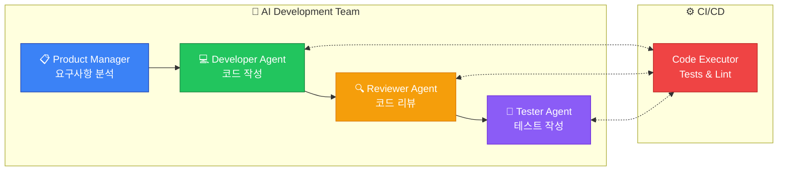
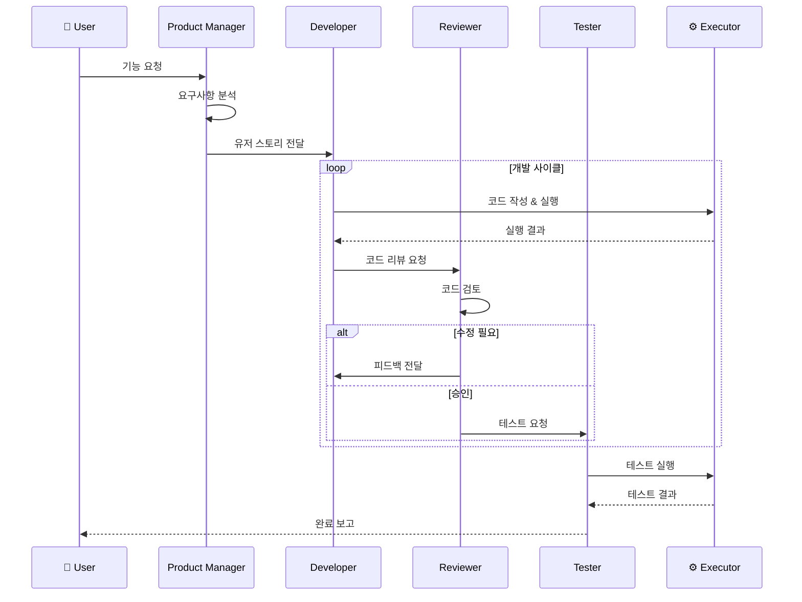

# 소프트웨어 개발 워크플로우


AutoGen을 활용한 AI 지원 소프트웨어 개발 시스템 구축 사례입니다.

## 개발 워크플로우 아키텍처



### 개발 프로세스 흐름



## 에이전트 구현

### Product Manager Agent

```python
from autogen import AssistantAgent, UserProxyAgent, GroupChat, GroupChatManager

pm_agent = AssistantAgent(
    name="product_manager",
    system_message="""You are an experienced Product Manager.

Your responsibilities:
1. Break down feature requests into technical requirements
2. Define acceptance criteria
3. Prioritize tasks
4. Ensure alignment with business goals

When given a feature request:
1. Clarify any ambiguous requirements
2. Create user stories in the format:
   "As a [user type], I want [feature] so that [benefit]"
3. Define clear acceptance criteria
4. Identify technical considerations
5. Estimate complexity (Low/Medium/High)

Output format:
```
## Feature: [Name]

### User Stories
- US1: As a..., I want..., so that...

### Acceptance Criteria
- [ ] Criteria 1
- [ ] Criteria 2

### Technical Considerations
- Consideration 1

### Complexity: [Low/Medium/High]
### Priority: [P0/P1/P2/P3]
```
""",
    llm_config={
        "config_list": config_list,
        "temperature": 0.5
    }
)
```

### Developer Agent

```python
developer_agent = AssistantAgent(
    name="developer",
    system_message="""You are a senior software developer with expertise in Python.

Your responsibilities:
1. Write clean, maintainable code
2. Follow best practices and design patterns
3. Include proper error handling
4. Write docstrings and type hints
5. Consider edge cases

Coding standards:
- PEP 8 compliance
- Type hints for all functions
- Docstrings in Google format
- Meaningful variable names
- Single responsibility principle
- DRY (Don't Repeat Yourself)

When implementing features:
1. Start with the interface/contract
2. Implement core functionality
3. Add error handling
4. Write unit tests
5. Document the code

Always output complete, runnable code.
""",
    llm_config={
        "config_list": config_list,
        "temperature": 0.3
    }
)
```

### Code Reviewer Agent

```python
reviewer_agent = AssistantAgent(
    name="code_reviewer",
    system_message="""You are a senior code reviewer with security expertise.

Your review checklist:
1. **Functionality**
   - Does it meet requirements?
   - Are edge cases handled?

2. **Code Quality**
   - Is it readable and maintainable?
   - Are names meaningful?
   - Is there code duplication?

3. **Security**
   - SQL injection vulnerabilities?
   - XSS vulnerabilities?
   - Sensitive data exposure?
   - Input validation?

4. **Performance**
   - Time complexity concerns?
   - Memory usage?
   - Unnecessary operations?

5. **Testing**
   - Are tests comprehensive?
   - Are edge cases tested?
   - Is test coverage adequate?

Review format:
```
## Code Review

### Summary
[Brief assessment]

### Severity Levels
- 🔴 Critical: Must fix before merge
- 🟠 Major: Should fix
- 🟡 Minor: Nice to fix
- 💡 Suggestion: Consider for future

### Findings
1. [Finding] - [Severity]
   - Location: [file:line]
   - Issue: [description]
   - Suggestion: [fix]

### Approval Status
[APPROVED / CHANGES_REQUESTED / NEEDS_DISCUSSION]
```
""",
    llm_config={
        "config_list": config_list,
        "temperature": 0.2
    }
)
```

### Tester Agent

```python
tester_agent = AssistantAgent(
    name="tester",
    system_message="""You are a QA engineer specializing in test automation.

Your responsibilities:
1. Write comprehensive unit tests
2. Create integration tests
3. Design test cases for edge cases
4. Ensure high code coverage

Testing frameworks:
- pytest for Python
- Use fixtures for test setup
- Mock external dependencies
- Parameterize tests when appropriate

Test categories:
1. Happy path tests
2. Edge case tests
3. Error handling tests
4. Boundary tests
5. Integration tests

Output format:
- Complete test files
- Test documentation
- Coverage expectations
""",
    llm_config={
        "config_list": config_list,
        "temperature": 0.2
    }
)
```

## 개발 파이프라인 구현

```python
class SoftwareDevPipeline:
    """소프트웨어 개발 파이프라인"""

    def __init__(self, config_list: list, workspace: str = "dev_workspace"):
        self.config_list = config_list
        self.workspace = workspace
        os.makedirs(workspace, exist_ok=True)

        self._setup_agents()

    def _setup_agents(self):
        """에이전트 설정"""
        self.pm = pm_agent
        self.developer = developer_agent
        self.reviewer = reviewer_agent
        self.tester = tester_agent

        self.executor = UserProxyAgent(
            name="executor",
            human_input_mode="NEVER",
            code_execution_config={
                "work_dir": self.workspace,
                "use_docker": False,
                "timeout": 180
            }
        )

    def develop_feature(self, feature_request: str) -> dict:
        """기능 개발 전체 워크플로우"""
        results = {
            "phases": [],
            "final_code": None,
            "tests": None,
            "review": None
        }

        # Phase 1: 요구사항 분석
        print("Phase 1: Analyzing requirements...")
        requirements = self._analyze_requirements(feature_request)
        results["phases"].append({"phase": "requirements", "result": requirements})

        # Phase 2: 개발
        print("Phase 2: Developing...")
        code = self._develop(requirements)
        results["phases"].append({"phase": "development", "result": code})

        # Phase 3: 테스트 작성
        print("Phase 3: Writing tests...")
        tests = self._write_tests(code)
        results["phases"].append({"phase": "testing", "result": tests})
        results["tests"] = tests

        # Phase 4: 코드 리뷰
        print("Phase 4: Code review...")
        review = self._review_code(code, tests)
        results["phases"].append({"phase": "review", "result": review})
        results["review"] = review

        # Phase 5: 리뷰 반영 (필요시)
        if "CHANGES_REQUESTED" in review:
            print("Phase 5: Addressing review feedback...")
            code = self._address_feedback(code, review)
            results["phases"].append({"phase": "revision", "result": code})

        results["final_code"] = code

        return results

    def _analyze_requirements(self, feature_request: str) -> str:
        """요구사항 분석"""
        result = self.executor.initiate_chat(
            self.pm,
            message=f"Analyze this feature request and create detailed requirements:\n\n{feature_request}",
            max_turns=2
        )
        return result.chat_history[-1]["content"]

    def _develop(self, requirements: str) -> str:
        """개발"""
        result = self.executor.initiate_chat(
            self.developer,
            message=f"""
Implement the following requirements:

{requirements}

Create complete, production-ready code.
Save the main module as 'feature.py' in the workspace.
""",
            max_turns=5
        )
        return result.chat_history[-1]["content"]

    def _write_tests(self, code: str) -> str:
        """테스트 작성"""
        result = self.executor.initiate_chat(
            self.tester,
            message=f"""
Write comprehensive tests for this code:

{code}

Create tests that cover:
1. All public functions
2. Edge cases
3. Error handling
4. Boundary conditions

Save tests as 'test_feature.py'.
""",
            max_turns=3
        )
        return result.chat_history[-1]["content"]

    def _review_code(self, code: str, tests: str) -> str:
        """코드 리뷰"""
        result = self.executor.initiate_chat(
            self.reviewer,
            message=f"""
Review the following code and tests:

## Main Code
{code}

## Tests
{tests}

Provide a thorough review following the review checklist.
""",
            max_turns=2
        )
        return result.chat_history[-1]["content"]

    def _address_feedback(self, code: str, review: str) -> str:
        """리뷰 피드백 반영"""
        result = self.executor.initiate_chat(
            self.developer,
            message=f"""
Address the following code review feedback:

## Original Code
{code}

## Review Feedback
{review}

Fix all issues marked as Critical or Major.
Provide the updated code.
""",
            max_turns=3
        )
        return result.chat_history[-1]["content"]

# 사용 예시
pipeline = SoftwareDevPipeline(config_list)

result = pipeline.develop_feature("""
Create a user authentication system with:
- User registration with email validation
- Password hashing using bcrypt
- JWT token generation for login
- Password reset functionality
""")
```

## 그룹 채팅 기반 개발

```python
def collaborative_development(feature_request: str) -> dict:
    """협업 기반 개발 (그룹 채팅)"""

    # 코드 실행기
    executor = UserProxyAgent(
        name="executor",
        human_input_mode="NEVER",
        code_execution_config={"work_dir": "workspace", "use_docker": False},
        is_termination_msg=lambda x: "DEVELOPMENT_COMPLETE" in x.get("content", "")
    )

    # 그룹 채팅 설정
    groupchat = GroupChat(
        agents=[executor, pm_agent, developer_agent, reviewer_agent, tester_agent],
        messages=[],
        max_round=40,
        speaker_selection_method="auto"
    )

    manager = GroupChatManager(
        groupchat=groupchat,
        llm_config={"config_list": config_list}
    )

    # 개발 시작
    result = executor.initiate_chat(
        manager,
        message=f"""
FEATURE DEVELOPMENT REQUEST

{feature_request}

Workflow:
1. PRODUCT_MANAGER: Analyze requirements and create user stories
2. DEVELOPER: Implement the feature
3. TESTER: Write tests and run them
4. CODE_REVIEWER: Review the code
5. DEVELOPER: Address any issues
6. Final: Output "DEVELOPMENT_COMPLETE" when done

Begin the development process.
"""
    )

    return {
        "conversation": result.chat_history,
        "summary": result.summary,
        "cost": result.cost
    }
```

## CI/CD 통합

```python
import subprocess

class CICDIntegration:
    """CI/CD 통합"""

    def __init__(self, workspace: str):
        self.workspace = workspace

    def run_linter(self, file_path: str) -> dict:
        """린터 실행"""
        try:
            result = subprocess.run(
                ["flake8", file_path],
                capture_output=True,
                text=True,
                cwd=self.workspace
            )
            return {
                "success": result.returncode == 0,
                "output": result.stdout,
                "errors": result.stderr
            }
        except Exception as e:
            return {"success": False, "error": str(e)}

    def run_tests(self, test_file: str) -> dict:
        """테스트 실행"""
        try:
            result = subprocess.run(
                ["pytest", test_file, "-v", "--tb=short"],
                capture_output=True,
                text=True,
                cwd=self.workspace
            )
            return {
                "success": result.returncode == 0,
                "output": result.stdout,
                "errors": result.stderr
            }
        except Exception as e:
            return {"success": False, "error": str(e)}

    def check_coverage(self, test_file: str) -> dict:
        """커버리지 확인"""
        try:
            result = subprocess.run(
                ["pytest", test_file, "--cov=.", "--cov-report=term-missing"],
                capture_output=True,
                text=True,
                cwd=self.workspace
            )
            return {
                "success": result.returncode == 0,
                "output": result.stdout
            }
        except Exception as e:
            return {"success": False, "error": str(e)}

    def run_security_scan(self, file_path: str) -> dict:
        """보안 스캔"""
        try:
            result = subprocess.run(
                ["bandit", "-r", file_path],
                capture_output=True,
                text=True,
                cwd=self.workspace
            )
            return {
                "success": result.returncode == 0,
                "output": result.stdout
            }
        except Exception as e:
            return {"success": False, "error": str(e)}

# 자동화된 검증 에이전트
def create_ci_agent(cicd: CICDIntegration):
    """CI 검증 에이전트 생성"""

    def run_ci_checks(code_file: str, test_file: str) -> str:
        """CI 체크 실행"""
        results = []

        # 린터
        lint_result = cicd.run_linter(code_file)
        results.append(f"Linter: {'PASS' if lint_result['success'] else 'FAIL'}")

        # 테스트
        test_result = cicd.run_tests(test_file)
        results.append(f"Tests: {'PASS' if test_result['success'] else 'FAIL'}")

        # 보안 스캔
        security_result = cicd.run_security_scan(code_file)
        results.append(f"Security: {'PASS' if security_result['success'] else 'FAIL'}")

        return "\n".join(results)

    return AssistantAgent(
        name="ci_agent",
        system_message="""You are a CI/CD automation agent.
Run automated checks on code changes and report results.
Use the provided tools to run linter, tests, and security scans.""",
        llm_config={"config_list": config_list}
    )
```

## 코드 리팩토링 워크플로우

```python
def refactor_code(code: str, refactoring_goals: str) -> dict:
    """코드 리팩토링"""

    refactoring_agent = AssistantAgent(
        name="refactoring_expert",
        system_message="""You are a refactoring expert.

Your approach:
1. Identify code smells
2. Apply appropriate refactoring patterns
3. Maintain functionality while improving structure
4. Ensure backward compatibility

Common refactoring patterns:
- Extract Method
- Extract Class
- Replace Conditional with Polymorphism
- Introduce Parameter Object
- Replace Magic Numbers with Constants

Always:
- Make small, incremental changes
- Keep tests passing after each change
- Document the refactoring reasoning
""",
        llm_config={"config_list": config_list}
    )

    executor = UserProxyAgent(
        name="executor",
        human_input_mode="NEVER",
        code_execution_config={"work_dir": "refactor_workspace"}
    )

    result = executor.initiate_chat(
        refactoring_agent,
        message=f"""
Refactor the following code:

```python
{code}
```

Refactoring goals:
{refactoring_goals}

Provide:
1. Analysis of current code issues
2. Refactored code
3. Explanation of changes made
4. Updated tests if needed
""",
        max_turns=5
    )

    return {
        "original": code,
        "refactored": result.chat_history[-1]["content"],
        "conversation": result.chat_history
    }
```

## Pull Request 자동화

```python
def create_pr_description(changes: str, ticket_id: str) -> str:
    """PR 설명 자동 생성"""

    pr_agent = AssistantAgent(
        name="pr_writer",
        system_message="""You write clear, informative PR descriptions.

Format:
## Summary
[Brief description of changes]

## Changes Made
- Change 1
- Change 2

## Testing
- [ ] Unit tests added/updated
- [ ] Integration tests pass
- [ ] Manual testing completed

## Related Issues
Fixes #[ticket_id]

## Screenshots (if applicable)
[Add screenshots for UI changes]

## Checklist
- [ ] Code follows style guidelines
- [ ] Self-review completed
- [ ] Documentation updated
""",
        llm_config={"config_list": config_list}
    )

    executor = UserProxyAgent(name="pr_creator", human_input_mode="NEVER")

    result = executor.initiate_chat(
        pr_agent,
        message=f"""
Create a PR description for:

Changes:
{changes}

Related Ticket: {ticket_id}
""",
        max_turns=1
    )

    return result.chat_history[-1]["content"]
```

## 문서 자동 생성

```python
def generate_documentation(code: str, doc_type: str = "api") -> str:
    """코드 문서 자동 생성"""

    doc_agent = AssistantAgent(
        name="documentation_writer",
        system_message="""You write technical documentation.

Documentation types:
1. API Documentation: Endpoints, parameters, responses
2. README: Overview, installation, usage
3. Architecture: System design, data flow
4. User Guide: Step-by-step instructions

Style:
- Clear and concise
- Include code examples
- Use proper formatting (markdown)
- Keep it up to date
""",
        llm_config={"config_list": config_list}
    )

    executor = UserProxyAgent(name="doc_generator", human_input_mode="NEVER")

    result = executor.initiate_chat(
        doc_agent,
        message=f"""
Generate {doc_type} documentation for:

```python
{code}
```

Make it comprehensive and developer-friendly.
""",
        max_turns=2
    )

    return result.chat_history[-1]["content"]
```
